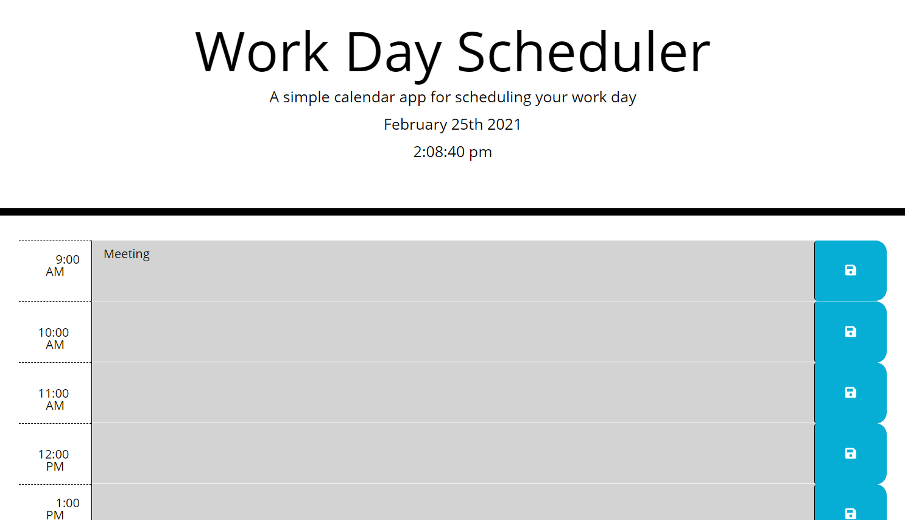

# Title

Day Planner Application

A day planning application which allows the user to create appointments or events for every hour of a standard business day. Shows current time and whether scheduled events are present, past, or coming up.

 

# Installation

A live deployment can be found here: <a href="https://nboutin109.github.io/Day-planner/">https://nboutin109.github.io/Day-planner/</a>

To use locally, simply download the files and open the index.html file with an internet browser.

## Built With
<ul>
<li>Bootstrap - CDN link included</li>
<li>jQuery - CDN link included</li>
<li>Moment.js - CDN link included</li>
</ul>

## Code Overview
 
The index.html file is rendered and styled with the included .css file and Bootstrap. The script.js page saves user input to local storage, and sets the page to be updated every second with the correct time and classes to show time on the planner.

